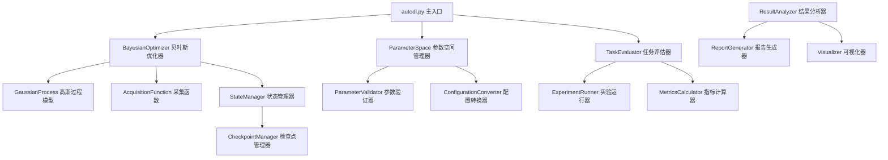

# 设计文档

## 概述

本设计文档描述了一个基于贝叶斯优化的超参数调优系统（autodl.py），该系统将集成到现有的深度学习实验框架中，为LDA/MDA/LMI三种任务提供智能化的参数搜索功能。系统采用高斯过程作为代理模型，使用多种采集函数进行参数空间探索，并支持多目标优化和状态持久化。

## 架构

系统采用模块化设计，主要包含以下核心组件：



## 组件和接口

### 1. BayesianOptimizer（贝叶斯优化器）

**职责**: 协调整个优化过程，管理高斯过程模型和采集函数

**主要方法**:
- `__init__(parameter_space, acquisition_function, n_initial_points=10)`
- `optimize(objective_function, n_iterations=100, checkpoint_freq=10)`
- `suggest_next_parameters() -> Dict[str, Any]`
- `update_model(parameters, objective_value)`
- `get_best_parameters() -> Tuple[Dict[str, Any], float]`

**接口依赖**:
- ParameterSpace: 获取参数空间定义
- GaussianProcess: 更新和查询代理模型
- AcquisitionFunction: 选择下一个评估点

### 2. ParameterSpace（参数空间管理器）

**职责**: 定义和管理所有可优化的参数及其约束

**主要方法**:
- `__init__()`
- `add_continuous_parameter(name, low, high, log_scale=False)`
- `add_discrete_parameter(name, values)`
- `add_categorical_parameter(name, categories)`
- `validate_parameters(parameters) -> bool`
- `sample_random_parameters() -> Dict[str, Any]`
- `get_bounds() -> List[Tuple[float, float]]`

**参数定义**:
```python
# 模型结构参数
continuous_params = {
    'dimensions': (128, 512),
    'hidden1': (64, 256), 
    'hidden2': (32, 128),
    'decoder1': (256, 1024),
    'lr': (1e-5, 1e-2, True),  # log_scale=True
    'dropout': (0.0, 0.5),
    'weight_decay': (1e-6, 1e-2, True),
    'alpha': (0.1, 2.0),
    'beta': (0.1, 2.0),
    'gamma': (0.1, 2.0)
}

discrete_params = {
    'gat_heads': [2, 4, 8, 16],
    'gt_heads': [2, 4, 8, 16],
    'fusion_heads': [2, 4, 8, 16],
    'batch': [16, 25, 32, 64],
    'moco_K': [1024, 2048, 4096, 8192]
}

categorical_params = {
    'fusion_strategy': ['self_attention', 'co_attention', 'hybrid', 'transformer_multihead'],
    'feature_type': ['normal', 'uniform', 'one_hot'],
    'moco_type': ['basic', 'double_tau']
}
```

### 3. TaskEvaluator（任务评估器）

**职责**: 执行具体的模型训练和评估，返回性能指标

**主要方法**:
- `__init__(task_type, data_config)`
- `evaluate_parameters(parameters) -> Dict[str, float]`
- `run_cross_validation(parameters, n_folds=5) -> Dict[str, float]`
- `setup_experiment_args(parameters) -> argparse.Namespace`

**评估流程**:
1. 将优化参数转换为实验配置
2. 执行5折交叉验证
3. 计算平均性能指标（AUROC、AUPRC、F1）
4. 返回AUROC作为主要优化目标（最大化）

### 4. GaussianProcess（高斯过程模型）

**职责**: 建模目标函数的不确定性，提供预测均值和方差

**主要方法**:
- `__init__(kernel, noise_level=1e-6)`
- `fit(X, y)`
- `predict(X_new) -> Tuple[np.ndarray, np.ndarray]`
- `update(X_new, y_new)`
- `get_hyperparameters() -> Dict[str, float]`

**核函数选择**: 使用Matérn 5/2核函数，适合处理非光滑的目标函数

### 5. AcquisitionFunction（采集函数）

**职责**: 决定下一个要评估的参数组合

**支持的采集函数**:
- **Expected Improvement (EI)**: 平衡探索和利用
- **Probability of Improvement (PI)**: 保守的改进策略
- **Upper Confidence Bound (UCB)**: 基于置信区间的选择
- **Entropy Search (ES)**: 基于信息熵的选择

**主要方法**:
- `__init__(function_type='EI', xi=0.01, kappa=2.576)`
- `evaluate(X, gp_model, best_value) -> np.ndarray`
- `optimize_acquisition(gp_model, bounds) -> np.ndarray`

### 6. StateManager（状态管理器）

**职责**: 管理优化过程的状态保存和恢复

**主要方法**:
- `save_state(optimizer, iteration, checkpoint_path)`
- `load_state(checkpoint_path) -> Dict[str, Any]`
- `create_checkpoint(optimizer, results_history)`
- `validate_checkpoint(checkpoint_path) -> bool`

**状态内容**:
- 高斯过程模型参数
- 历史评估记录
- 当前最佳参数组合
- 优化器配置信息

## 数据模型

### OptimizationResult（优化结果）
```python
@dataclass
class OptimizationResult:
    parameters: Dict[str, Any]
    objective_value: float
    metrics: Dict[str, float]  # AUROC, AUPRC, F1
    iteration: int
    timestamp: datetime
    evaluation_time: float
```

### OptimizationHistory（优化历史）
```python
@dataclass
class OptimizationHistory:
    results: List[OptimizationResult]
    best_result: OptimizationResult
    parameter_space: Dict[str, Any]
    acquisition_function: str
    task_type: str
    total_iterations: int
    total_time: float
```

### ParameterConfig（参数配置）
```python
@dataclass
class ParameterConfig:
    name: str
    param_type: str  # 'continuous', 'discrete', 'categorical'
    bounds: Optional[Tuple[float, float]]
    values: Optional[List[Any]]
    log_scale: bool = False
    constraints: Optional[List[str]] = None
```

## 错误处理

### 1. 参数验证错误
- **InvalidParameterError**: 参数值超出定义范围
- **ConstraintViolationError**: 参数组合违反约束条件
- **ConfigurationError**: 配置文件格式错误

### 2. 评估过程错误
- **EvaluationTimeoutError**: 单次评估超时
- **ModelTrainingError**: 模型训练失败
- **DataLoadingError**: 数据加载失败

### 3. 优化过程错误
- **ConvergenceError**: 优化过程未收敛
- **AcquisitionOptimizationError**: 采集函数优化失败
- **CheckpointError**: 状态保存/恢复失败

**错误处理策略**:
- 记录详细错误信息到日志
- 对于评估错误，返回惩罚性的目标函数值
- 提供错误恢复机制，跳过有问题的参数组合
- 在关键错误时保存当前状态并安全退出

## 测试策略

### 单元测试
- 测试每个组件的核心功能
- 验证参数验证逻辑
- 测试高斯过程模型的拟合和预测
- 验证采集函数的计算正确性

### 集成测试  
- 测试完整的优化流程
- 验证不同任务类型的评估
- 测试状态保存和恢复功能
- 验证多目标优化的正确性

### 性能测试
- 测试大规模参数空间的优化效率
- 验证内存使用情况
- 测试长时间运行的稳定性
- 评估并行评估的加速效果

**测试配置**:
- 使用模拟的快速目标函数进行功能测试
- 使用小规模数据集进行集成测试
- 每个属性测试运行最少100次迭代
- 测试标签格式: **Feature: bayesian-hyperparameter-optimization, Property {number}: {property_text}**

## 正确性属性

*属性是一个特征或行为，应该在系统的所有有效执行中保持为真——本质上是关于系统应该做什么的正式陈述。属性作为人类可读规范和机器可验证正确性保证之间的桥梁。*

### 属性反思

在分析所有可测试的验收标准后，我识别出以下需要合并或优化的冗余属性：

- 属性1.1和1.3都涉及系统初始化和完成行为，可以合并为一个综合的优化流程属性
- 属性2.3和2.4都涉及参数约束，可以合并为一个参数约束满足属性  
- 属性3.1、3.2、3.3可以合并为一个任务特定配置属性
- 属性5.1和5.2涉及状态保存和恢复，可以合并为状态持久化往返属性
- 属性7.1、7.3、7.5都涉及报告生成，可以合并为报告完整性属性

经过反思，以下是去除冗余后的核心正确性属性：

### 属性 1: 优化流程完整性
*对于任何*有效的优化配置，系统应该能够完整执行从初始化到完成的整个优化流程，并在达到停止条件时输出最佳结果
**验证: 需求 1.1, 1.3, 1.4**

### 属性 2: 参数评估一致性  
*对于任何*有效的参数组合，系统应该执行相同的5折交叉验证流程并返回一致格式的性能指标
**验证: 需求 1.2**

### 属性 3: 错误恢复能力
*对于任何*优化过程中的评估错误，系统应该记录错误信息并继续搜索其他参数组合，不会因单个错误而终止整个优化
**验证: 需求 1.5**

### 属性 4: 参数类型支持
*对于任何*连续型、离散型或分类型的参数定义，系统应该正确处理并支持该参数类型的搜索
**验证: 需求 2.1**

### 属性 5: 参数约束满足
*对于任何*定义的参数空间和约束条件，系统生成的所有参数组合都应该满足范围约束和约束条件
**验证: 需求 2.2, 2.3, 2.4**

### 属性 6: 参数空间重新初始化
*对于任何*参数空间的修改，系统应该重新初始化优化器状态并使用新的参数空间配置
**验证: 需求 2.5**

### 属性 7: 任务特定配置
*对于任何*支持的任务类型（LDA/MDA/LMI），系统应该加载对应的数据集、使用任务特定的预处理流程和正确的性能指标
**验证: 需求 3.1, 3.2, 3.3**

### 属性 8: 任务切换自适应
*对于任何*任务类型的切换，系统应该自动调整参数空间和评估策略，并在结果中包含正确的任务标识
**验证: 需求 3.4, 3.5**

### 属性 9: 最佳结果更新
*对于任何*发现的更好参数组合，系统应该更新当前最佳结果记录并保持最佳结果的准确性
**验证: 需求 4.3**

### 属性 10: 优化报告生成
*对于任何*完成的优化过程，系统应该生成包含最佳参数、性能指标和可视化图表的完整报告
**验证: 需求 4.5, 7.1**

### 属性 11: 状态持久化往返
*对于任何*优化状态，保存后重新加载应该恢复完全相同的优化器状态，包括高斯过程模型和所有历史观测数据
**验证: 需求 5.1, 5.2, 5.5**

### 属性 12: 损坏状态处理
*对于任何*检测到的损坏状态文件，系统应该提示用户并提供重新开始的选项，而不是崩溃
**验证: 需求 5.3**

### 属性 13: 检查点频率控制
*对于任何*指定的检查点频率，系统应该按照该频率间隔保存优化状态
**验证: 需求 5.4**

### 属性 14: 采集函数支持
*对于任何*支持的采集函数类型（EI、PI、UCB），系统应该正确实现该采集函数并用于参数选择
**验证: 需求 6.1**

### 属性 15: 采集函数参数验证
*对于任何*采集函数参数的调整，系统应该验证参数有效性并正确应用新设置
**验证: 需求 6.3**

### 属性 16: 参数敏感性分析
*对于任何*完成的优化过程，系统应该计算每个参数对目标函数的敏感性并包含在分析结果中
**验证: 需求 7.2**

### 属性 17: 可视化内容完整性
*对于任何*生成的可视化图表，应该包含收敛曲线、参数分布和性能热力图等指定元素
**验证: 需求 7.3**

### 属性 18: 历史记录完整性
*对于任何*优化过程，历史记录应该包含所有评估过的参数组合和对应结果，不遗漏任何评估
**验证: 需求 7.4**

### 属性 19: 报告内容完整性
*对于任何*保存的优化报告，应该包含实验配置、数据集信息和统计分析结果等所有必要信息
**验证: 需求 7.5**

### 属性 20: 多目标优化支持
*对于任何*指定的多个目标函数，系统应该支持帕累托前沿优化并计算所有目标函数值
**验证: 需求 8.1, 8.2**

### 属性 21: 帕累托最优解返回
*对于任何*多目标优化的完成，系统应该返回真正的帕累托最优解集合
**验证: 需求 8.4**

### 属性 22: 加权目标函数计算
*对于任何*设置的目标权重，系统应该根据权重正确计算加权目标函数值
**验证: 需求 8.5**