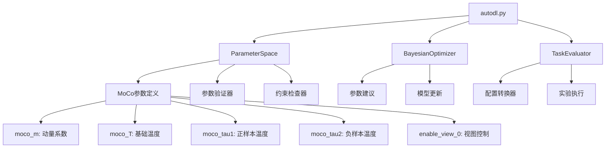
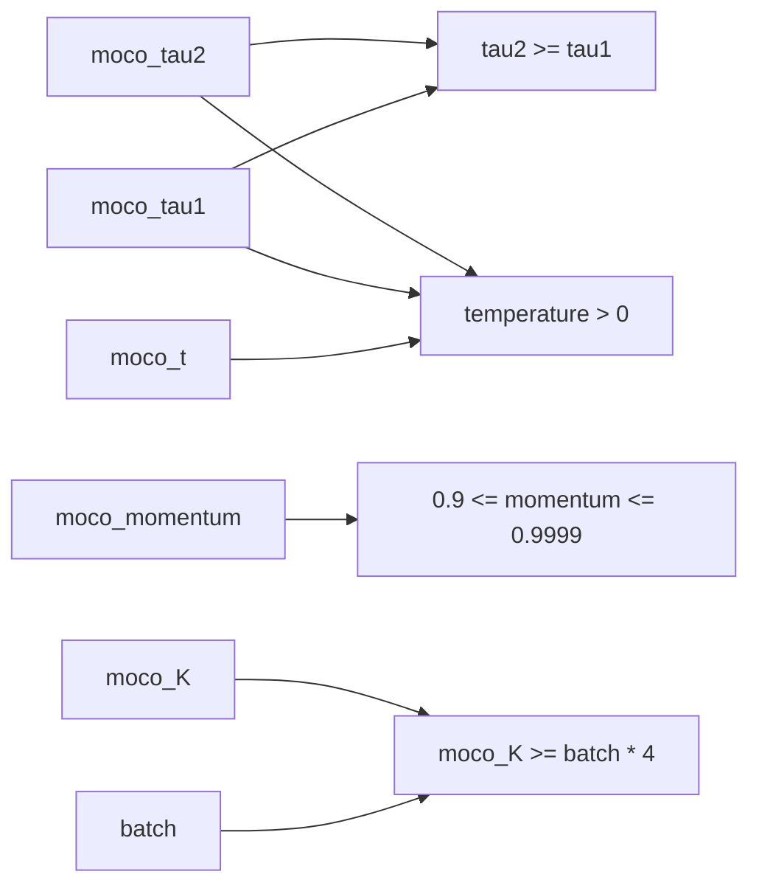

# 设计文档

## 概述

本设计文档描述了如何在现有的贝叶斯优化器系统中集成MoCo（Momentum Contrast）对比学习相关的超参数支持。设计将扩展现有的参数空间管理、参数验证、配置转换等核心组件，同时保持向后兼容性。

**设计原则**: MoCo参数仅通过配置文件支持，不提供命令行参数支持。这种设计确保了：
- 配置的一致性和可重现性
- 复杂参数组合的清晰管理
- 避免命令行参数过多导致的可用性问题

## 架构

### 核心组件交互



### 参数层次结构

现有系统已经支持以下MoCo参数：
- `moco_K`: MoCo队列大小（离散型，值：[1024, 2048, 4096, 8192]）
- `moco_queue`: MoCo队列长度（整数，默认4096）
- `moco_momentum`: MoCo动量（浮点，默认0.999）
- `moco_t`: MoCo温度（浮点，默认0.2）
- `proj_dim`: 投影维度（整数，默认跟随hidden2）
- `queue_warmup_steps`: 队列预热步数（整数，默认0）
- `moco_type`: MoCo类型（分类型，值：['basic', 'double_tau']）

需要新增的参数：
- `moco_m`: MoCo动量更新系数（与moco_momentum重复，需要统一）
- `moco_T`: MoCo基础温度系数（与moco_t重复，需要统一）
- `moco_tau1`: DoubleTau MoCo正样本温度系数
- `moco_tau2`: DoubleTau MoCo负样本温度系数
- `enable_view_0`: 是否启用MoCo第0视图

## 组件和接口

### 1. 参数空间扩展 (ParameterSpace)

#### 新增参数定义

```python
# 在create_default_parameter_space()中添加：

# DoubleTau MoCo特定参数
space.add_continuous_parameter('moco_tau1', 0.01, 1.0)  # 正样本温度
space.add_continuous_parameter('moco_tau2', 0.01, 1.0)  # 负样本温度

# 视图控制参数
space.add_categorical_parameter('enable_view_0', ['true', 'false'])
```

#### 参数统一策略

为避免重复参数，采用以下统一策略：
- 保留现有的`moco_momentum`，移除重复的`moco_m`
- 保留现有的`moco_t`，移除重复的`moco_T`
- 在配置转换时处理参数名称映射

### 2. 参数验证扩展 (ParameterValidator)

#### 新增约束函数

```python
def moco_tau_constraint(params: Dict[str, Any]) -> bool:
    """DoubleTau MoCo温度约束：tau2应该大于等于tau1"""
    if all(key in params for key in ['moco_tau1', 'moco_tau2']):
        tau1 = float(params['moco_tau1'])
        tau2 = float(params['moco_tau2'])
        return tau2 >= tau1
    return True

def moco_momentum_range_constraint(params: Dict[str, Any]) -> bool:
    """MoCo动量系数应该在合理范围内"""
    if 'moco_momentum' in params:
        momentum = float(params['moco_momentum'])
        return 0.9 <= momentum <= 0.9999
    return True

def moco_temperature_positive_constraint(params: Dict[str, Any]) -> bool:
    """所有MoCo温度参数应该为正值"""
    temp_params = ['moco_t', 'moco_tau1', 'moco_tau2']
    for param in temp_params:
        if param in params:
            temp = float(params[param])
            if temp <= 0:
                return False
    return True
```

### 3. 配置转换扩展 (ConfigurationConverter)

#### 参数映射更新

```python
def convert_to_experiment_config(self, parameters: Dict[str, Any]) -> Dict[str, Any]:
    # 现有映射保持不变
    direct_mappings = {
        # ... 现有映射 ...
        'moco_tau1': 'moco_tau1',
        'moco_tau2': 'moco_tau2',
        'enable_view_0': 'enable_view_0'
    }
    
    # 特殊处理
    if 'enable_view_0' in parameters:
        # 转换字符串到布尔值
        config['enable_view_0'] = str(parameters['enable_view_0']).lower() == 'true'
```

### 4. 任务评估器更新 (TaskEvaluator)

#### 参数传递增强

```python
def _create_args_from_parameters(self, parameters: Dict[str, Any]) -> argparse.Namespace:
    # 现有参数设置保持不变
    
    # 新增MoCo参数设置
    if 'moco_tau1' in parameters:
        args.moco_tau1 = float(parameters['moco_tau1'])
    
    if 'moco_tau2' in parameters:
        args.moco_tau2 = float(parameters['moco_tau2'])
    
    if 'enable_view_0' in parameters:
        args.enable_view_0 = str(parameters['enable_view_0']).lower() == 'true'
    
    return args
```

## 数据模型

### 参数配置数据结构

```python
@dataclass
class MoCoParameterConfig:
    """MoCo参数配置"""
    # 基础参数
    moco_K: int = 4096                    # 队列大小
    moco_momentum: float = 0.999          # 动量系数
    moco_t: float = 0.2                   # 基础温度
    proj_dim: Optional[int] = None        # 投影维度
    queue_warmup_steps: int = 0           # 队列预热步数
    
    # DoubleTau特定参数
    moco_tau1: float = 0.2                # 正样本温度
    moco_tau2: float = 0.3                # 负样本温度
    
    # 视图控制
    enable_view_0: bool = True            # 是否启用第0视图
    
    # 类型选择
    moco_type: str = 'basic'              # MoCo类型
```

### 约束关系图



## 正确性属性

*属性是一个特征或行为，应该在系统的所有有效执行中保持为真——本质上是关于系统应该做什么的正式陈述。属性作为人类可读规范和机器可验证正确性保证之间的桥梁。*

现在我需要使用prework工具来分析验收标准的可测试性：

<function_calls>
<invoke name="prework">
<parameter name="featureName">moco-hyperparameter-integration

基于预工作分析，以下是经过冗余消除后的核心正确性属性：

### 属性 1: MoCo参数解析和类型转换
*对于任何* 包含MoCo参数的配置文件，解析后的参数应该具有正确的类型（浮点数、整数、布尔值），并且所有新的MoCo参数都应该被正确识别和设置
**验证: 需求 1.1, 7.1, 7.2**

### 属性 2: MoCo参数验证约束
*对于任何* MoCo参数组合，验证函数应该正确执行以下约束：动量系数在[0.9, 0.9999]范围内，所有温度参数为正值，DoubleTau模式下tau2 >= tau1，队列大小参数保持一致性
**验证: 需求 2.1, 2.2, 2.3, 2.4**

### 属性 3: 参数空间完整性和采样
*对于任何* 参数空间创建和采样操作，生成的参数组合应该包含所有预期的MoCo参数定义，并且采样的参数组合应该满足所有约束条件
**验证: 需求 3.1, 3.2**

### 属性 4: 参数修复一致性
*对于任何* 违反MoCo约束的参数组合，修复函数应该生成满足所有约束的有效参数组合
**验证: 需求 3.3**

### 属性 5: 贝叶斯优化器参数处理
*对于任何* 贝叶斯优化过程，优化器建议的参数组合应该是有效的，MoCo参数应该被正确编码为特征向量，并且参数应该正确传递给任务评估器
**验证: 需求 4.1, 4.2, 4.3**

### 属性 6: 配置转换完整性
*对于任何* 优化参数到实验配置的转换，所有MoCo参数应该被正确映射，别名参数应该被正确处理，转换后的配置应该通过验证
**验证: 需求 5.1, 5.2, 5.3**

### 属性 7: 向后兼容性保证
*对于任何* 现有配置或缺少新参数的历史数据，系统应该继续正常工作，使用合理的默认值，并且能够正确加载和处理历史数据
**验证: 需求 6.1, 6.2, 6.3**

### 属性 8: 多目标优化MoCo支持
*对于任何* 多目标优化过程，MoCo参数应该被正确包含在帕累托前沿计算中，目标函数计算应该考虑MoCo参数的影响，帕累托最优解应该包含完整的MoCo参数配置
**验证: 需求 8.1, 8.2, 8.3**

## 错误处理

### 参数验证错误

```python
class MoCoParameterError(Exception):
    """MoCo参数相关错误"""
    pass

class MoCoConstraintViolationError(MoCoParameterError):
    """MoCo参数约束违反错误"""
    pass

class MoCoConfigurationError(MoCoParameterError):
    """MoCo配置错误"""
    pass
```

### 错误处理策略

1. **参数解析错误**: 提供清晰的错误信息，指出具体的参数名称和期望的值类型
2. **约束违反错误**: 详细说明违反的约束条件和建议的修复方案
3. **配置转换错误**: 记录转换失败的参数和原因，提供回退机制
4. **向后兼容性错误**: 优雅降级，使用默认值并记录警告信息

### 错误恢复机制

```python
def handle_moco_parameter_error(error: MoCoParameterError, parameters: Dict[str, Any]) -> Dict[str, Any]:
    """处理MoCo参数错误并尝试恢复"""
    if isinstance(error, MoCoConstraintViolationError):
        # 尝试自动修复约束违反
        return suggest_parameter_fix(parameters)
    elif isinstance(error, MoCoConfigurationError):
        # 使用默认配置
        return get_default_moco_config()
    else:
        # 记录错误并继续
        logger.warning(f"MoCo参数错误: {error}")
        return parameters
```

## 测试策略

### 双重测试方法

本系统采用单元测试和基于属性的测试相结合的方法：

**单元测试**：
- 验证特定的MoCo参数配置示例
- 测试边界条件和错误情况
- 验证组件之间的集成点
- 测试向后兼容性场景

**基于属性的测试**：
- 通过随机化验证通用属性
- 全面的输入覆盖
- 约束验证的压力测试
- 参数组合的正确性验证

### 基于属性的测试配置

- **最小迭代次数**: 每个属性测试100次（由于随机化）
- **测试库**: 使用Python的Hypothesis库进行基于属性的测试
- **标签格式**: **功能: moco-hyperparameter-integration, 属性 {编号}: {属性文本}**
- **需求追溯**: 每个正确性属性必须由单一的基于属性的测试实现

### 测试覆盖范围

1. **参数解析测试**: 验证所有MoCo参数的正确解析和类型转换
2. **约束验证测试**: 测试所有MoCo参数约束的正确执行
3. **参数空间测试**: 验证参数空间的完整性和采样正确性
4. **优化器集成测试**: 测试贝叶斯优化器与MoCo参数的集成
5. **配置转换测试**: 验证参数到配置的转换正确性
6. **兼容性测试**: 确保向后兼容性和错误恢复
7. **多目标优化测试**: 验证多目标场景下的MoCo参数处理

### 单元测试平衡

- 单元测试专注于具体示例和边界情况
- 避免编写过多单元测试 - 基于属性的测试处理大量输入覆盖
- 单元测试应该专注于：
  - 演示正确行为的具体示例
  - 组件之间的集成点
  - 边界情况和错误条件
- 基于属性的测试应该专注于：
  - 适用于所有输入的通用属性
  - 通过随机化实现全面的输入覆盖

## 实现注意事项

### 性能考虑

1. **参数验证缓存**: 对于重复的参数组合，缓存验证结果
2. **约束检查优化**: 按照约束的计算复杂度排序，先检查简单约束
3. **特征编码效率**: 优化MoCo参数到数值向量的转换过程

### 内存管理

1. **参数历史**: 限制存储的参数历史记录数量
2. **配置缓存**: 实现LRU缓存机制管理配置转换结果
3. **错误日志**: 定期清理错误日志以防止内存泄漏

### 并发安全

1. **参数空间访问**: 确保参数空间的线程安全访问
2. **配置转换**: 使用不可变数据结构避免并发修改
3. **错误处理**: 确保错误处理机制的线程安全性

### 可扩展性设计

1. **插件架构**: 支持未来添加新的MoCo变体
2. **配置模板**: 提供可扩展的配置模板机制
3. **约束系统**: 设计可扩展的约束检查框架