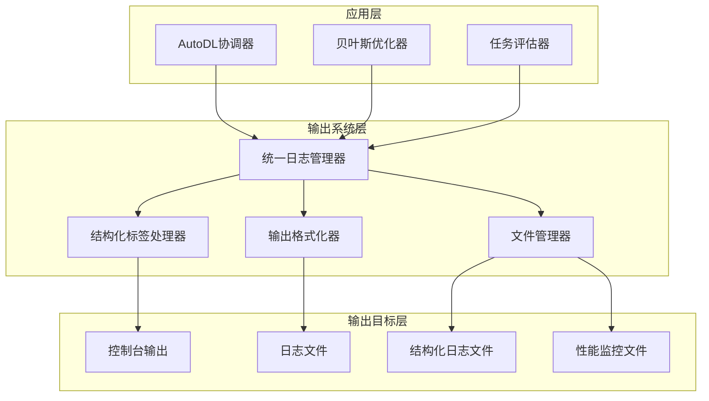

# 设计文档

## 概述

全面重写输出系统的设计方案，创建一个统一、详细、结构化的日志输出系统。该系统将移除所有emoji表情符号，极大增强信息详细程度，实现完整的文件日志保存，并为贝叶斯优化过程、模型训练过程和主程序协调提供一致的输出风格。

设计采用分层架构，包含统一的日志管理器、结构化标签系统、多级别输出控制和自动文件管理功能。

## 架构

### 系统架构图



### 分层设计

1. **应用层**: 现有的三个主要组件，通过统一接口使用输出系统
2. **输出系统层**: 核心的输出处理逻辑，包含日志管理、标签处理、格式化和文件管理
3. **输出目标层**: 最终的输出目标，包括控制台、各种类型的日志文件

## 组件和接口

### 1. 统一日志管理器 (UnifiedLogManager)

核心组件，负责协调所有日志输出。

```python
class UnifiedLogManager:
    def __init__(self, 
                 run_name: str,
                 log_level: int = logging.INFO,
                 enable_console: bool = True,
                 enable_file: bool = True,
                 log_dir: str = "logs"):
        pass
    
    def log_with_tag(self, level: int, tag: str, message: str, 
                     component: str = None, **kwargs):
        """带标签的日志输出"""
        pass
    
    def log_structured(self, level: int, tag: str, data: Dict[str, Any],
                      component: str = None):
        """结构化数据日志输出"""
        pass
    
    def log_progress(self, tag: str, current: int, total: int, 
                    message: str = "", **metrics):
        """进度日志输出"""
        pass
```

### 2. 结构化标签处理器 (StructuredTagProcessor)

处理和验证结构化标签。

```python
class StructuredTagProcessor:
    # 预定义的标签类别
    TRAINING_TAGS = ["TRAINING", "EPOCH", "BATCH", "LOSS", "METRICS"]
    CONFIG_TAGS = ["CONFIG", "PARAMS", "SETUP", "INIT"]
    OPTIMIZATION_TAGS = ["OPTIMIZATION", "ACQUISITION", "SUGGESTION", "CONVERGENCE"]
    SYSTEM_TAGS = ["SYSTEM", "MEMORY", "GPU", "CPU", "DISK"]
    STATUS_TAGS = ["ERROR", "WARNING", "INFO", "DEBUG", "SUCCESS"]
    RESULTS_TAGS = ["RESULTS", "ANALYSIS", "SUMMARY", "REPORT"]
    
    def validate_tag(self, tag: str) -> bool:
        """验证标签是否有效"""
        pass
    
    def format_tag(self, tag: str, level: str = None) -> str:
        """格式化标签显示"""
        pass
```

### 3. 输出格式化器 (OutputFormatter)

负责格式化不同类型的输出内容。

```python
class OutputFormatter:
    def format_training_info(self, epoch: int, batch: int, 
                           loss_info: Dict[str, float], 
                           metrics: Dict[str, float]) -> str:
        """格式化训练信息"""
        pass
    
    def format_optimization_info(self, iteration: int, 
                               suggested_params: Dict[str, Any],
                               acquisition_value: float,
                               gp_stats: Dict[str, Any]) -> str:
        """格式化优化信息"""
        pass
    
    def format_system_info(self, gpu_info: Dict[str, Any],
                          memory_info: Dict[str, Any]) -> str:
        """格式化系统信息"""
        pass
    
    def format_error_info(self, error: Exception, 
                         context: Dict[str, Any]) -> str:
        """格式化错误信息"""
        pass
```

### 4. 文件管理器 (FileManager)

管理日志文件的创建、轮转和组织。

```python
class FileManager:
    def __init__(self, base_dir: str, run_name: str):
        self.base_dir = Path(base_dir)
        self.run_name = run_name
        self.run_dir = self.base_dir / f"{run_name}_{datetime.now().strftime('%Y%m%d_%H%M%S')}"
        
    def create_log_files(self) -> Dict[str, Path]:
        """创建各种类型的日志文件"""
        pass
    
    def rotate_log_file(self, file_path: Path, max_size: int = 100*1024*1024):
        """轮转日志文件"""
        pass
    
    def cleanup_old_logs(self, keep_days: int = 30):
        """清理旧日志文件"""
        pass
```

## 数据模型

### 日志条目结构

```python
@dataclass
class LogEntry:
    timestamp: datetime
    level: str
    tag: str
    component: str
    message: str
    structured_data: Optional[Dict[str, Any]] = None
    context: Optional[Dict[str, Any]] = None
    
    def to_console_format(self) -> str:
        """转换为控制台显示格式"""
        pass
    
    def to_file_format(self) -> str:
        """转换为文件存储格式"""
        pass
    
    def to_json(self) -> str:
        """转换为JSON格式"""
        pass
```

### 进度跟踪结构

```python
@dataclass
class ProgressInfo:
    tag: str
    current: int
    total: int
    percentage: float
    start_time: datetime
    elapsed_time: timedelta
    estimated_remaining: Optional[timedelta] = None
    metrics: Dict[str, Any] = field(default_factory=dict)
    
    def format_progress_bar(self, width: int = 50) -> str:
        """格式化进度条显示"""
        pass
```

## 正确性属性

*属性是一个特征或行为，应该在系统的所有有效执行中保持为真——本质上，是关于系统应该做什么的正式声明。属性作为人类可读规范和机器可验证正确性保证之间的桥梁。*

现在我需要使用prework工具来分析验收标准的可测试性：

基于prework分析，以下是经过反思和去重后的正确性属性：

### 属性 1: Emoji移除完整性
*对于任何* 系统输出内容，输出中都不应包含任何emoji表情符号，所有emoji都应被替换为对应的文本描述
**验证: 需求 1.1, 1.2, 1.3**

### 属性 2: 结构化标签正确性
*对于任何* 输出信息类型，系统都应使用与信息类型对应的正确结构化标签（训练信息使用TRAINING标签，配置信息使用CONFIG标签等）
**验证: 需求 3.1, 3.2, 3.3, 3.4, 3.5, 3.6**

### 属性 3: 输出信息完整性
*对于任何* 组件的操作过程，输出都应包含该过程的所有关键信息（参数、状态、进度、结果等）
**验证: 需求 2.1, 2.2, 2.3, 2.4, 2.5, 5.1, 5.2, 5.3, 5.4, 5.5, 6.1, 6.2, 6.3, 6.4, 6.5**

### 属性 4: 双重输出一致性
*对于任何* 日志输出，控制台显示的内容和写入文件的内容应保持一致
**验证: 需求 4.2**

### 属性 5: 文件管理自动化
*对于任何* 日志文件操作，系统都应自动处理文件创建、轮转、命名和清理，无需人工干预
**验证: 需求 4.1, 4.3, 4.5**

### 属性 6: 格式一致性保持
*对于任何* 新实现的输出功能，其格式、详细程度和显示方式都应与现有task_evaluator.py保持一致
**验证: 需求 7.1, 7.2, 7.3, 7.4, 7.5**

### 属性 7: 日志接口统一性
*对于任何* 组件的日志需求，都应通过统一的日志管理器接口来实现，确保格式和功能的一致性
**验证: 需求 8.1, 8.4**

### 属性 8: 并发安全性
*对于任何* 并发的日志写入操作，系统都应确保数据完整性和线程安全，不出现数据损坏或丢失
**验证: 需求 8.5**

### 属性 9: 数据持久化完整性
*对于任何* 系统关闭或异常情况，所有已生成的日志数据都应完整地保存到磁盘中
**验证: 需求 4.4**

### 属性 10: 动态配置响应性
*对于任何* 日志级别或配置的动态调整，系统都应立即响应并应用新的配置，无需重启
**验证: 需求 8.2, 8.3**

## 错误处理

### 错误类型和处理策略

1. **文件系统错误**
   - 磁盘空间不足: 自动清理旧日志，发送警告
   - 权限不足: 降级到控制台输出，记录错误
   - 文件锁定: 重试机制，超时后报错

2. **格式化错误**
   - 数据类型不匹配: 使用默认格式，记录警告
   - 编码错误: 使用UTF-8编码，替换无效字符
   - 模板错误: 使用简化格式，记录错误

3. **并发错误**
   - 线程竞争: 使用锁机制保护关键区域
   - 资源竞争: 队列缓冲，异步处理
   - 死锁检测: 超时机制，自动恢复

4. **配置错误**
   - 无效配置: 使用默认值，发送警告
   - 配置冲突: 优先级规则，记录决策
   - 配置缺失: 自动补全，记录操作

### 错误恢复机制

```python
class ErrorRecoveryManager:
    def handle_file_error(self, error: FileSystemError) -> RecoveryAction:
        """处理文件系统错误"""
        if error.type == "DISK_FULL":
            return self.cleanup_old_logs()
        elif error.type == "PERMISSION_DENIED":
            return self.fallback_to_console()
        else:
            return self.retry_with_backoff()
    
    def handle_format_error(self, error: FormatError) -> str:
        """处理格式化错误"""
        return self.apply_safe_format(error.data)
    
    def handle_concurrency_error(self, error: ConcurrencyError) -> bool:
        """处理并发错误"""
        return self.retry_with_lock(error.operation)
```

## 测试策略

### 双重测试方法

系统将采用单元测试和属性测试相结合的方法：

**单元测试重点:**
- 特定的错误处理场景
- 边界条件和异常情况
- 组件间的集成点
- 文件系统操作的具体实现

**属性测试重点:**
- 通用的正确性属性验证
- 大量随机输入的处理
- 并发场景下的数据一致性
- 长期运行的稳定性

### 属性测试配置

- **最小迭代次数**: 每个属性测试运行100次迭代
- **测试标签格式**: **Feature: output-system-rewrite, Property {number}: {property_text}**
- **并发测试**: 使用多线程模拟真实使用场景
- **性能测试**: 验证大量日志输出下的性能表现

### 测试数据生成策略

1. **随机文本生成**: 包含各种字符集、emoji、特殊字符
2. **模拟组件行为**: 生成真实的训练、优化、协调过程数据
3. **异常场景模拟**: 文件系统错误、内存不足、网络中断等
4. **并发场景构造**: 多线程、多进程的日志写入竞争

### 集成测试场景

1. **端到端流程测试**: 完整的优化流程日志记录
2. **长期运行测试**: 24小时连续运行的稳定性验证
3. **资源限制测试**: 在受限环境下的降级处理
4. **兼容性测试**: 与现有task_evaluator.py的集成验证